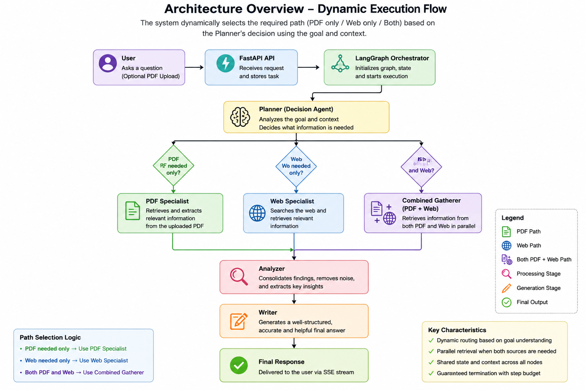

# Research Assistant

> **Multi-Agent Research Assistant built with FastAPI, LangGraph, React, Gemini, ChromaDB and PostgreSQL.**

## Setup Instructions (≤5 Steps)

1. Clone the repository and create backend/frontend environments.
2. Install dependencies (`pip install -r requirements.txt` and `npm install`).
3. Configure `.env` with Gemini, Serper and PostgreSQL credentials.
4. Start PostgreSQL and run the database schema.
5. Run `uvicorn main:app --reload` and `npm run dev`.

---

# Architecture Overview

A user submits a goal (optionally with a PDF). The orchestrator creates a shared TaskState and invokes the planner. The planner determines whether PDF retrieval, web search, or both are required. The corresponding specialist agents gather evidence, which is merged and summarized by the analyzer. Finally, the writer produces a coherent answer that is streamed to the frontend through Server-Sent Events (SSE).

---

# Agents Designed and Why

## Orchestrator
Coordinates execution, manages routing, maintains shared state, streams progress, and enforces execution limits.

## Planner
Determines whether the task requires:
- PDF Retrieval
- Web Search
- Both

This prevents unnecessary LLM calls.

## PDF Specialist
Retrieves relevant chunks from the uploaded document using Chroma vector search.

## Web Specialist
Collects external information through Serper search.

## Combined Gatherer
Runs PDF and Web gathering concurrently whenever both are required.

## Analyzer
Removes redundancy, combines evidence, and produces structured findings.

## Writer
Produces the final user-facing response from analyzed evidence.

---

# Context & State Strategy

The application uses a shared `TaskState` object across all LangGraph nodes.

The state stores:
- User goal
- Planning decision
- Retrieved PDF context
- Retrieved web context
- Analyzer findings
- Final response
- Execution trace

To keep context bounded:
- Retrieved text is limited (`MAX_FINDINGS_CHARS`)
- Only relevant chunks are retrieved (`TOP_K`)
- Intermediate outputs replace older data instead of continuously growing.

---

# Reliability Strategy

The system guarantees reliable execution through:
- Maximum step budget (`MAX_STEPS`)
- Directed acyclic execution flow
- No recursive routing
- Context size limits
- Minimal LLM invocations

These ensure termination, prevent loops, and bound execution cost.

---

# Failure Handling

The backend implements:

- Retry for transient failures (408, 429, 500, 502, 503, 504)
- Exponential backoff
- Fail-fast for permanent errors (401,403,404)
- Honest stopping when recovery is impossible
- Structured SSE error events to inform the UI

No partial answer is returned after unrecoverable failures.

---

# Prompt Design Strategy

Each agent has a dedicated prompt.

Planner:
- Determines required information sources.
- Returns structured JSON.

Specialists:
- Retrieve only relevant evidence.

Analyzer:
- Merge duplicate information.
- Produce concise findings.

Writer:
- Generate the final answer using only validated findings.
- Avoid hallucinations by grounding responses in gathered evidence.

---

# Assumptions Made

- Uploaded PDFs contain extractable text.
- Web search API is available.
- Gemini APIs are reachable.
- PostgreSQL and Chroma are operational.
- Users ask research-oriented questions.

---

# Improvements

Given more time, the system could include:

- Parallel execution of multiple specialist agents
- Memory across conversations
- Citation ranking
- Human-in-the-loop verification
- Adaptive planning
- Cost-aware model selection
- Better observability dashboards
- Multi-document retrieval
- Streaming token generation

---

The remaining sections from the original README (Project Layout, Configuration, SSE Events, Error Handling, Troubleshooting, etc.) should be retained as they already accurately document the implementation.
